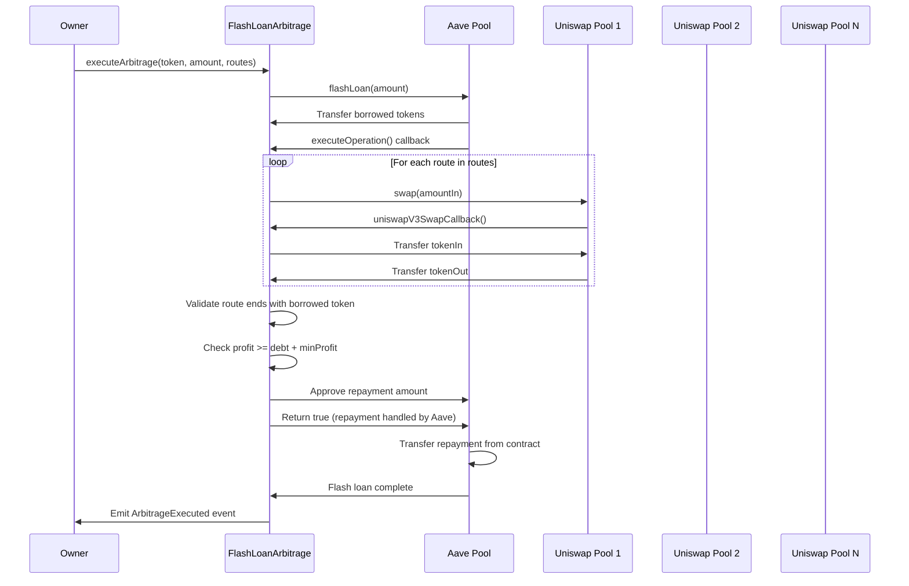

# Flash Loan Arbitrage Bot
A Solidity smart contract that executes arbitrage opportunities using Aave V3 flash loans and Uniswap V3 pools.

## Setup

### Prerequisites

- [Foundry](https://book.getfoundry.sh/getting-started/installation) installed
- [Node.js](https://nodejs.org/) and npm installed

### Installation

1. **Clone the repository:**
   ```bash
   git clone <repository-url>
   cd flash-loan-arbitrage
   ```

2. **Install Foundry dependencies (git submodules):**
   ```bash
   forge install
   ```
   This will install:
   - `forge-std` - Foundry standard library
   - `v3-core` - Uniswap V3 Core contracts
   - `openzeppelin-contracts-upgradeable` - OpenZeppelin contracts
   - `openzeppelin-foundry-upgrades` - OpenZeppelin Foundry upgrades
   
   **Note:** If cloning fresh, you may also need:
   ```bash
   git submodule update --init --recursive
   ```

3. **Install npm dependencies:**
   ```bash
   npm install
   ```
   This will install:
   - `@aave/core-v3` - Aave V3 Core contracts (for Solidity interfaces)
   
   **Note:** `package-lock.json` is committed to ensure consistent versions.

4. **Set up environment variables:**
   
   Create a `.env` file in the root directory:
   ```bash
   cp .env.example .env
   # Then edit .env and fill in your values
   ```
   
   Add the following environment variables to your `.env` file:
   
   **Required for deployment:**
   ```bash
   # Your private key
   PRIVATE_KEY=your_private_key_here
   
   # Aave V3 Pool address for your target network, in this case we use Base one.
   AAVE_POOL_ADDRESS=0xA238Dd80C259a72e81d7e4664a9801593F98d1c5
   ```
   
   **Optional variables:**
   ```bash
   # Minimum profit threshold in wei (default: 0.001 ETH)
   MIN_PROFIT_WEI=1000000000000000
   
   # For checking/updating deployed contract
   FLASH_LOAN_CONTRACT_ADDRESS=0x...
   NEW_MIN_PROFIT_WEI=1
   
   # For contract verification (Base)
   BASESCAN_API_KEY=your_basescan_api_key
   
   # For fork tests (optional)
   HTTP_RPC_URL=https://mainnet.base.org
   CHAIN_ID=8453
   ```
   
   **Security Note:** Never commit your `.env` file. It's already in `.gitignore`.

5. **Build the project:**
   ```bash
   forge build
   ```

## Usage 

### Build

```bash
forge build
```

### Test

```bash
forge test
```

### Format

```bash
forge fmt
```

### Deploy

```bash
forge script script/Deploy.s.sol:DeployFlashLoanArbitrage --rpc-url base --broadcast
```

## Project Structure

```
flash-loan-arbitrage/
├── src/
│   └── FlashLoanArbitrage.sol     # Main arbitrage contract
├── script/                        # Deployment scripts
├── test/                          # Test files
├── lib/                           # Foundry dependencies (git submodules)
├── node_modules/                  # npm dependencies
├── foundry.toml                   # Foundry configuration
├── remappings.txt                 # Solidity import remappings
└── package.json                   # npm dependencies
```

## How It Works

The contract executes arbitrage opportunities by borrowing funds via Aave flash loans, executing swaps across multiple Uniswap V3 pools, and repaying the loan with profit.



## Flash Loan Comparison: Aave vs Uniswap

This contract uses **Aave V3 flash loans**, but both Aave and Uniswap offer flash loan capabilities. Here's a comparison:

| Feature | Aave V3 Flash Loans | Uniswap V3 Flash Swaps |
|---------|---------------------|------------------------|
| **Supported Tokens** | All Aave-supported assets (100+ tokens) | Only tokens in the specific pool (2 tokens per pool) |
| **Borrowing Capacity** | Limited by Aave liquidity pool | Limited by pool liquidity |
| **Fee Structure** | Fixed fee: 0.05% - 0.09% of borrowed amount | No fee (only pay back what you borrow) |
| **Use Cases** | Multi-token arbitrage, complex DeFi operations | Same-pair arbitrage (token0 ↔ token1 in one pool) |
| **Flexibility** | Can borrow multiple tokens simultaneously | Single pool, two tokens only |
| **Gas Cost** | ~50,000 - 70,000 gas | ~40,000 - 60,000 gas |
| **Best For** | Cross-pool arbitrage, multi-hop strategies | Same-pool price differences, simple arbitrage |

### Why This Contract Uses Aave

- **Multi-token support**: Can borrow any Aave-supported token for cross-pool arbitrage
- **Flexible routing**: Execute swaps across multiple Uniswap V3-compatible pools with different token pairs
- **Higher liquidity**: Aave pools typically have deeper liquidity than individual Uniswap pools
- **Proven infrastructure**: Aave is battle-tested with billions in TVL

**Note:** This contract uses `IUniswapV3Pool` interface, so it works with:
- Uniswap V3 pools
- DEXs that implement the Uniswap V3 pool interface (e.g., some Uniswap V3 forks)
- Any protocol that uses the same `IUniswapV3Pool` interface

It does **not** work with DEXs that use different interfaces (e.g., Uniswap V2, Curve, Balancer, etc.) unless they implement the Uniswap V3 interface.

### When to Use Uniswap Flash Swaps

Uniswap flash swaps are better when:
- You only need to arbitrage within a single pool (e.g., WETH/USDC)
- You want zero fees (only pay back what you borrow)
- The arbitrage opportunity exists in the same pool pair

## Swap Strategy Comparison: Direct Pool Swaps vs Multihop Router

This contract uses **direct pool swaps** in a loop rather than Uniswap's SwapRouter multihop. Here's why:

| Aspect | Direct Pool Swaps (Current) | SwapRouter Multihop |
|--------|----------------------------|---------------------|
| **Gas Cost** | Lower (~5,000-10,000 gas saved per hop) | Higher (router overhead) |
| **Control** | Full control over each swap | Router handles routing |
| **Best For** | Arbitrage bots, gas-sensitive operations | User-facing apps, simple swaps |

### Current Implementation

```solidity
// Direct pool swaps - optimal for arbitrage
for (uint256 i = 0; i < routes.length; i++) {
    currentBalance = _executeSwap(
        route.pool,
        route.zeroForOne,
        route.tokenIn,
        currentBalance
    );
}
```

### Alternative: SwapRouter Multihop

```solidity
// Would use SwapRouter (not implemented)
ISwapRouter.ExactInputParams memory params = ISwapRouter.ExactInputParams({
    path: abi.encodePacked(token0, fee0, token1, fee1, token2),
    recipient: address(this),
    deadline: block.timestamp,
    amountIn: amountIn,
    amountOutMinimum: 0
});
swapRouter.exactInput(params);
```

**When to use SwapRouter:**
- Building user-facing applications
- Simpler code is preferred over gas optimization
- Path encoding is handled automatically

### Gas Cost Breakdown

**SwapRouter.swapExactInputSingle()** adds significant gas overhead:

| Operation | Gas Cost | Why It's Needed |
|-----------|----------|-----------------|
| **Token Transfer** | ~2,100 gas | Router transfers tokens from caller to router |
| **Approval Check** | ~2,400 gas | Router checks/updates token approvals |
| **Router Logic** | ~3,000-5,000 gas | Path validation, fee calculation, parameter encoding |
| **Additional Storage** | ~2,000 gas | Router maintains state for routing |
| **Total Overhead** | **~9,500-11,500 gas** | Per swap operation |

**Direct pool.swap()** eliminates this overhead:
- No token transfers (tokens already in contract from flash loan)
- No approval checks (callback handles payment directly)
- No router logic (direct pool interaction)
- No additional storage (minimal state tracking)

**Gas Savings is critical for arbitrage profitability.**

## Dependencies

### Foundry Dependencies (via `forge install`)
- `forge-std` - Testing and scripting utilities
- `v3-core` - Uniswap V3 interfaces
- `openzeppelin-contracts-upgradeable` - OpenZeppelin contracts

### npm Dependencies (via `npm install`)
- `@aave/core-v3` - Aave V3 interfaces

## Documentation

- [Foundry Book](https://book.getfoundry.sh/)
- [Aave V3 Documentation](https://docs.aave.com/)
- [Uniswap V3 Documentation](https://docs.uniswap.org/contracts/v3/overview)
